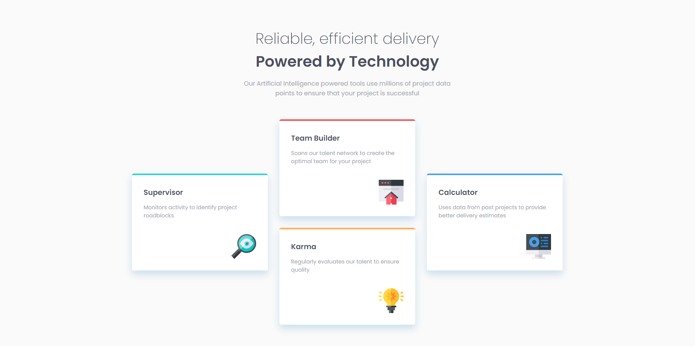

# Frontend Mentor - Four card feature section solution

This is a solution to the [Four card feature section challenge on Frontend Mentor](https://www.frontendmentor.io/challenges/four-card-feature-section-weK1eFYK). Frontend Mentor challenges help you improve your coding skills by building realistic projects. 

### Screenshot

### Links

- Solution URL: [[Github]](https://github.com/MousaAzm/four-card-feature-section)
- Live Site URL: [Live Design](https://mousaazm.github.io/four-card-feature-section/)

### Built with

- HTML5 
- CSS 
- SCSS

## Author

- Frontend Mentor - [@MousaAzimi](https://www.frontendmentor.io/profile/MousaAzm)